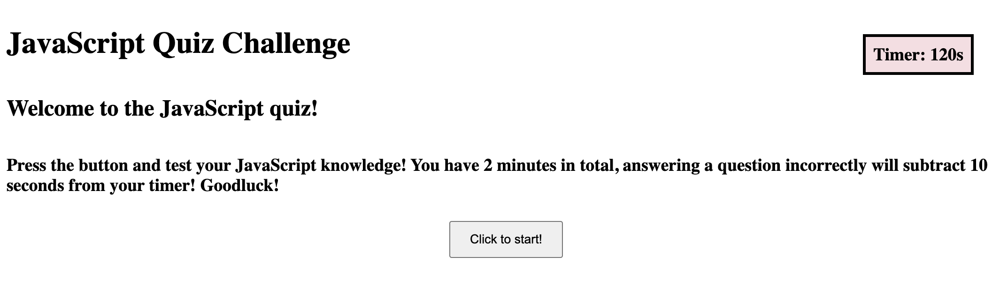

# JavaScript Quiz Challenge

## Description
This webpage was built to demonstrate my knowledge of JavaScript. Using a variety of different JavaScript methods, this timed quiz can evaluate the user input as correct or incorrect, and store the user's final score in their local storage.

## Installation
N/A

## Usage
This quiz can be used to study JavaScript concepts. 
https://rileysong01.github.io/javascript-quiz/

## Credits
N/A

## License
Please refer to the LICENSE in the repo.